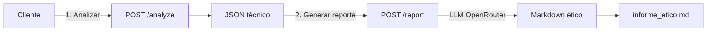

# 📄 Ethical Reporter - Documentación

## Descripción

El **Ethical Reporter** es un endpoint integrado en el orquestador que genera **informes éticos en markdown** desde el JSON técnico devuelto por `/analyze`.

Transforma evaluaciones técnicas en narrativa comprensible para audiencias no técnicas:
- Ejecutivos
- Equipos de Compliance
- Equipos legales
- RRHH
- Auditores

---

## Cómo Funciona

### Flujo de 2 Pasos

```
1. POST /analyze  →  JSON técnico con evaluación ética
         ↓
2. POST /report  →  Markdown legible para humanos
```

### Arquitectura



---

## API

### POST /report

**Request:**
```json
{
  "analysis_result": { ... },  // JSON completo del /analyze
  "language": "es",             // "es" o "en" (default: "es")
  "focus": ["risk", "findings", "recommendations"]  // Secciones
}
```

**Response:**
```json
{
  "markdown": "# 📊 Informe Ético...",
  "generated_at": "2026-01-07T10:30:00Z",
  "language": "es",
  "word_count": 324
}
```

---

## Ejemplos de Uso

### Ejemplo 1: Bash/cURL

```bash
# 1. Analizar
curl -X POST http://localhost:8000/analyze \
  -H "Content-Type: application/json" \
  -d '{
    "system_prompt": "Asistente RRHH",
    "user_input": "Juan es mejor porque es hombre",
    "agents": []
  }' > analysis.json

# 2. Generar reporte
curl -X POST http://localhost:8000/report \
  -H "Content-Type: application/json" \
  -d "{\"analysis_result\": $(cat analysis.json)}" \
  | jq -r '.markdown' > informe_etico.md

# 3. Ver informe
cat informe_etico.md
```

---

### Ejemplo 2: PowerShell

```powershell
# 1. Analizar
$analysis = Invoke-RestMethod -Uri "http://localhost:8000/analyze" `
  -Method POST -ContentType "application/json" `
  -Body '{"system_prompt": "RRHH", "user_input": "Texto", "agents": []}'

# 2. Generar reporte
$report = Invoke-RestMethod -Uri "http://localhost:8000/report" `
  -Method POST -ContentType "application/json" `
  -Body ($analysis | ConvertTo-Json -Depth 10)

# 3. Guardar
$report.markdown | Out-File -Encoding UTF8 "informe_etico.md"
```

---

### Ejemplo 3: Python

```python
import httpx
import asyncio

async def generate_ethical_report():
    async with httpx.AsyncClient() as client:
        # 1. Analizar
        analysis = await client.post(
            "http://localhost:8000/analyze",
            json={
                "system_prompt": "Asistente RRHH",
                "user_input": "Compara candidatos",
                "agents": []
            }
        )
        analysis_json = analysis.json()
        
        # 2. Generar reporte
        report = await client.post(
            "http://localhost:8000/report",
            json={"analysis_result": analysis_json}
        )
        report_json = report.json()
        
        # 3. Guardar
        with open("informe_etico.md", "w", encoding="utf-8") as f:
            f.write(report_json["markdown"])
        
        print(f"✓ Informe generado: {report_json['word_count']} palabras")

asyncio.run(generate_ethical_report())
```

---

### Ejemplo 4: Cliente Python Helper

Usando el script de prueba incluido:

```bash
python test_reporter.py
```

Esto genera automáticamente:
1. Análisis ético de un caso de contratación
2. Informe markdown en `informe_etico_demo.md`

---

## Estructura del Informe

El markdown generado incluye típicamente:

```markdown
# 📊 Informe Ético - Evaluación de Sistema IA

## Resumen Ejecutivo
Decisión: ⛔ BLOCK  
Nivel de Riesgo: 0.85 / 1.0

Descripción breve de los principales hallazgos...

## Hallazgos Principales

### 🚨 Sesgo de Género
Descripción del sesgo detectado con contexto de negocio.

**Marco**: UNESCO Principle 6  
**Severidad**: Alta (score: 0.6)

### ⚖️ Cumplimiento EU AI Act
Evaluación de riesgos según Art. 9...

## Recomendaciones

### Acciones Inmediatas
1. Corrección del algoritmo
2. Auditoría de datos

### Medidas a Medio Plazo
- Monitoreo continuo
- Capacitación del equipo

## Conclusión
Decisión final con justificación.
```

---

## Modos de Generación

### Modo Producción (LLM)

Usa OpenRouter para generar narrativa profesional y contextualizada.

**Activado cuando**: `SKIP_LLM_SUMMARY=false` (default)

**Coste**: ~200-400 tokens por informe (promedio)

**Ventajas**:
- ✅ Narrativa natural y fluida
- ✅ Contextualizada al caso específico
- ✅ Emojis y formato profesional
- ✅ Adaptada al idioma (es/en)

### Modo Test (Determinista)

Genera un informe básico sin LLM.

**Activado cuando**: `SKIP_LLM_SUMMARY=true`

**Coste**: 0 tokens

**Ventajas**:
- ✅ Inmediato (sin latencia LLM)
- ✅ Útil para testing end-to-end
- ✅ No requiere API key

---

## Configuración

### Variables de Entorno

Las mismas del orquestador:

| Variable | Descripción |
|----------|-------------|
| `OPENROUTER_API_KEY` | API key de OpenRouter |
| `OPENROUTER_MODEL` | Modelo LLM (default: gpt-3.5-turbo) |
| `SKIP_LLM_SUMMARY` | `true` para modo test |

---

## Personalización

### Idioma

Soporta español (default) e inglés:

```json
{
  "analysis_result": {...},
  "language": "en"  // ← Informe en inglés
}
```

### Secciones

Personaliza qué incluir en el informe:

```json
{
  "analysis_result": {...},
  "focus": ["risk", "recommendations"]  // ← Solo riesgo y recomendaciones
}
```

Opciones:
- `"risk"`: Evaluación de riesgos
- `"findings"`: Hallazgos detallados
- `"recommendations"`: Recomendaciones accionables

---

## Testing

### Test Básico

```bash
# Generar análisis de prueba
python test_reporter.py
```

### Verificar Formato Markdown

```bash
# Validar que sea markdown válido
cat informe_etico_demo.md | head -30
```

---

## Casos de Uso

### 1. Compliance Report para Auditoría
```python
# Generar informe para auditoría trimestral
analysis = analyze_all_systems()
report = generate_report(analysis, language="en")
send_to_compliance_team(report["markdown"])
```

### 2. Revisión Ejecutiva
```python
# Informe resumido para C-level
report = generate_report(
    analysis, 
    focus=["risk", "recommendations"]
)
send_to_ceo(report["markdown"])
```

### 3. Documentación Técnica
```python
# Informe completo para equipo técnico
report = generate_report(
    analysis,
    focus=["risk", "findings", "recommendations"]
)
attach_to_jira_ticket(report["markdown"])
```

---

## Beneficios

| Beneficio | Descripción |
|-----------|-------------|
| **Accesibilidad** | Transforma JSON técnico en lenguaje natural |
| **Profesional** | Formato markdown listo para compartir |
| **Multiidioma** | Soporte español/inglés |
| **Accionable** | Recomendaciones claras |
| **Trazabilidad** | Incluye timestamp y contexto |

---

## Limitaciones

1. **Coste LLM**: ~200-400 tokens por reporte (modo producción)
2. **Latencia**: 2-5 segundos para generación con LLM
3. **Idiomas**: Solo español e inglés actualmente

---

## Roadmap

- [ ] Soporte para más idiomas (francés, alemán)
- [ ] Templates personalizables por empresa
- [ ] Generación de PDFs
- [ ] Gráficos embedded en markdown
- [ ] Exportación a Word/HTML
